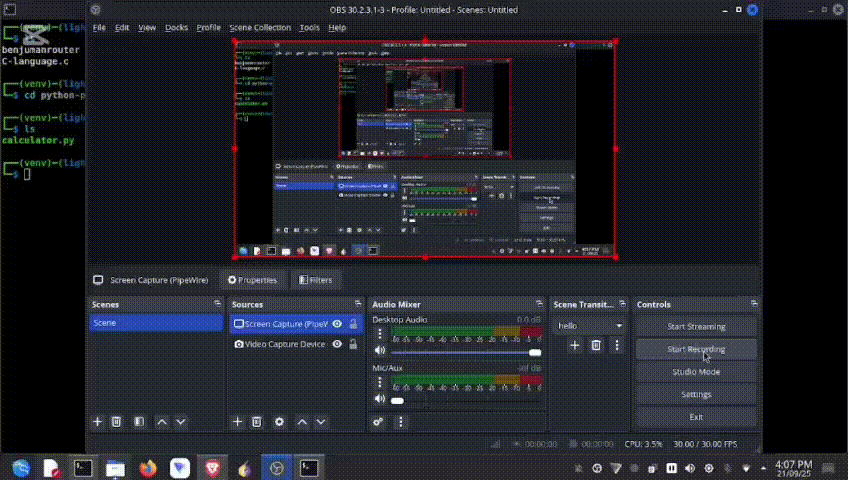

# 🎨 Colorful Python Calculator

A simple **terminal-based calculator** written in **Python** with colorful output using the `colorama` module.  
This project is perfect for **beginners** to practice Python functions, loops, exception handling, and working with modules.

# Calculator view:


---
## **Features**
- Addition ➕
- Multiplication ✖️
- Division ➗
- Modulus (Reminder) %
- Subtraction ➖
- Colorful outputs using `colorama` (for better readability)
- User-friendly **menu-driven interface**
- Handles errors like division by zero or invalid input gracefully
- Continuous operation until user chooses to exit

---

## **Installation**

1. Clone the repository:
```bash
git clone https://github.com/HACK-LEGEND-HAMID/Calculator-in-python.git
cd Calculator-in-python
python3 calculator.py
